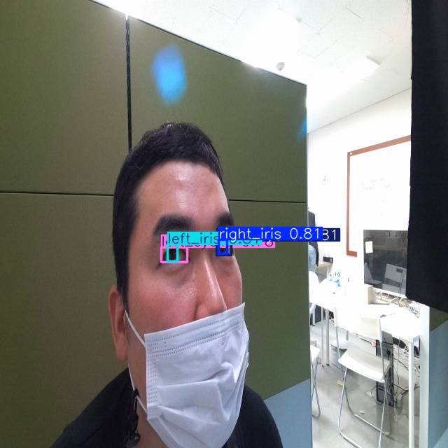
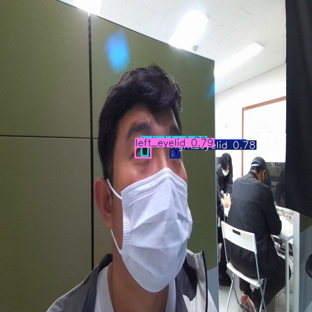
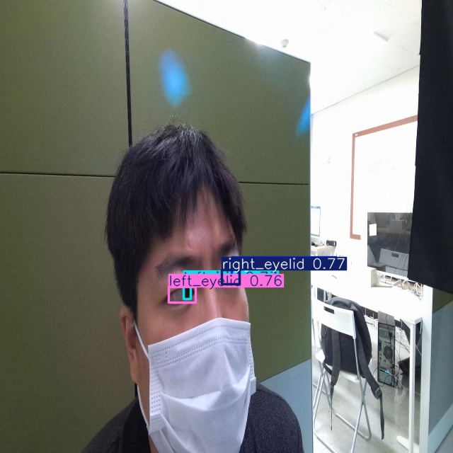
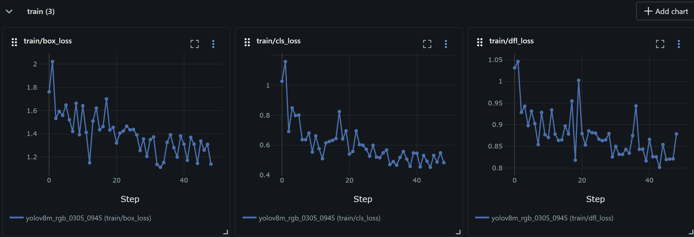
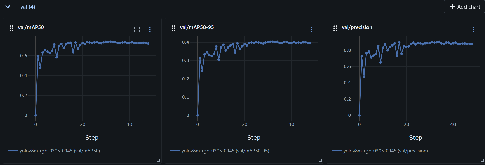

# AI TIL - 2026.03.06

## 1. 오늘 학습한 주요 개념 (Core Concepts)

### 1.1. 객체 탐지(Object Detection)를 위한 데이터 엔지니어링
- **RGB 기반 AI 모델 지향**: 통제된 적외선(IR) 환경이 아닌 일상적인 조명과 웹캠(RGB) 환경에서 구동 가능한 안구(홍채) 추적 파이프라인의 설계 개념을 다룸.
- **라벨링 전처리 자동화**: 기존의 다각형과 점 형태의 원본 XML 데이터를 YOLO 모델의 학습 규격에 맞추어 사각형 바운딩 박스로 변환함. 최솟값과 최댓값을 연산하여 좌표를 치환하는 수학적 전처리 로직의 구현 개념을 이해함.

### 1.2. 모델 학습 환경의 한계 극복 및 최적화
- **AMP (Automatic Mixed Precision, 혼합 정밀도)**: 로컬 하드웨어(8GB VRAM)의 메모리 초과(OOM) 오류를 방지하고자, 텐서 연산 시 자료형의 정밀도를 유동적으로 조절하여 메모리 효율과 연산 속도를 동시에 높이는 기법.
- **Early Stopping & MLflow**: 모델이 훈련 데이터에 너무 과적합(Overfitting)되는 현상을 막는 예방적 학습 제어 기법. 또한 MLflow 툴을 활용해 손실률(Loss), 정밀도(Precision), mAP 등의 핵심 정량 지표를 시각화하여 모니터링 체계를 구축하는 개념.

### 1.3. 모델 추론 결과(Inference) 확인 및 검증
학습된 모델을 기반으로 무작위 검증 데이터에 대한 안구 탐지(Inference) 추론 테스트를 경험했습니다. 결과적으로, 아래 사진 자료들과 같이 통제되지 않은 일반 조명 및 다양한 각도의 환경에서도 좌/우 홍채 영역에 정확도를 띠며 바운딩 박스를 형성하는 것을 시각적으로 확인했습니다.

  
  
  

<em>▲ RGB(일반 웹캠) 환경 내 안구(홍채) 탐지 추론(Inference) 시각화 결과</em>

---

## 🧠 2. 깨달은 점 (Insights & Realizations)

### 2.1. "알고리즘 그 이상으로 중요한 데이터 파이프라인의 견고함"
총 16,000여 장에 이르는 막대한 이미지 파일과 전처리 과정을 거치면서 I/O 병목 에러와 캐시(Cache) 충돌을 직접 경험했습니다. 에러를 디버깅하는 과정 속에서, 아무리 고성능의 AI 알고리즘을 사용하더라도 결국 **대용량의 데이터를 안정적으로 적재하고 제어할 수 있는 시스템 파이프라인 역량이 뒷받침되어야 함**을 실감했습니다.

### 2.2. "직관이 아닌 숫자에 기반한 객관적인 실험 기획 (MLOps 마인드)"
과거에는 파라미터를 수정할 때 어렴풋한 짐작으로 접근하곤 했으나, MLflow를 통해 실시간으로 수집되는 평가지표들을 마주하면서 접근 방식이 달라졌습니다. **철저히 정량화된 로그와 지표를 근거로 모델의 객관적인 성과를 평가**하고, 다음 번 튜닝 방향을 어떻게 가져갈지 결정하는 체계적인 MLOps의 기초적 효용성을 크게 깨달았습니다.

  
  

<em>▲ MLflow 대시보드 - Error/Loss(좌) 및 객체 탐지 성능 지표(mAP, Precision)(우) 실시간 추적</em>

---

## 🔄 3. KPT 리뷰 (Keep, Problem, Try)

- **[KEEP] 제약 속에서도 해답을 찾아 구현하는 엔지니어링 마인드**
  - 자원 부족(8GB VRAM)과 대용량 데이터라는 제약에 굴복하지 않고 AMP, Early Stopping, 커스텀 라벨링 스크립트 등 여러 기술적 해법을 총동원해 끝끝내 동작하는 파이프라인을 구축해낸 끈기를 유지할 것입니다.
- **[PROBLEM] 상용화 수준 요구치(97%)의 미달성**
  - 어떤 문제로 인해 목표치인 precision 97%에 도달하지 못했는지 원인을 명확하게 파악하기 힘들었습니다.
- **[TRY] 고도화 파이프라인 도입**
  - 향후 Instance Segmentation 기법과 Cascade(다단계) 모델 연계 추론 구조를 적용해보고, 한계를 넘어설 수 있는지 테스트 해볼 것입니다.
