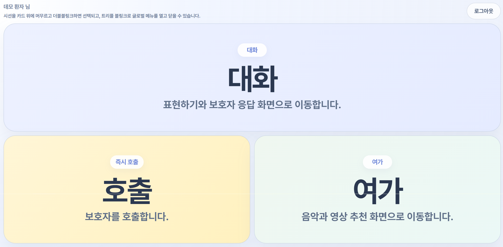
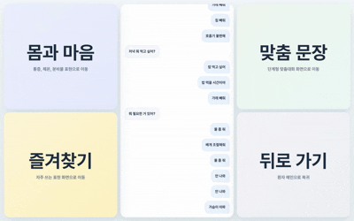
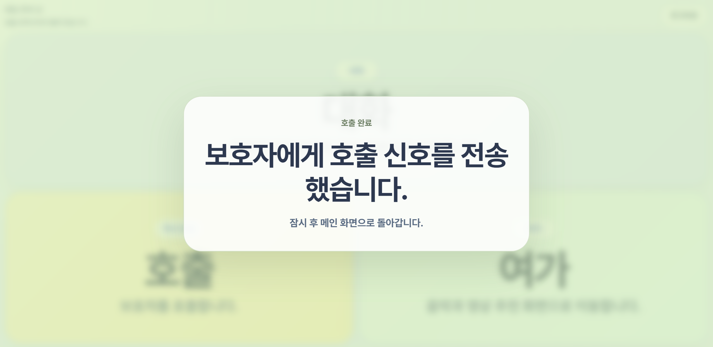

<div align="center">

# 👀 eyespeak(아이스피크)

**눈으로 마음을 전하다, eyeSpeak**


- **루게릭병(ALS) 환자를 위한 시선 기반 AI 의사소통 플랫폼** <br>
- **시선 추적 기반 환자-보호자 의사소통 보조 서비스**
- **개발 기간** : 2026.02.16 ~ 2026.04.03 **(7주)**
- **플랫폼** : 인공지능(영상)
- **개발 인원** : 7명
- **주관** : 삼성 청년 SW·AI 아카데미 14기<br><br>

</div> <br>

## 🔎 목차

<div align="center">

### <a href="#developers">🌟 팀원 구성</a>
### <a href="#techStack">🛠️ 기술 스택</a>
### <a href="#systemArchitecture">🌐 시스템 아키텍처</a>
### <a href="#skills">📲 기능 구성</a>
### <a href="#feature">🏛️ 기능 시연</a>
### <a href="#directories">📂 디렉터리 구조</a>
### <a href="#projectDeliverables">📦 프로젝트 산출물</a>

</div>
<br>

## 🌟 팀원 구성

<a name="developers"></a>

<div align="center">

<table width="100%">
    <tr>
        <td width="33%" align="center"> 
            <a href="https://github.com/chaezerojj">
                
            </a>
            <hr> <a href="https://github.com/chaezerojj">
                <b>진채영</b><br>(Leader & Frontend) 
            </a> 
        </td>
        <td width="33%" align="center"> 
            <a href="https://github.com/brightonlog1">
                
            </a>
            <hr> <a href="https://github.com/brightonlog1">
                <b>김예린</b><br>(Backend & AI) 
            </a> 
        </td>
        <td width="33%" align="center"> 
            <a href="https://github.com/naneunhaeun">
                
            </a>
            <hr> <a href="https://github.com/naneunhaeun">
                <b>김하은</b><br>(AI) 
            </a> 
        </td>
    </tr>
    <tr>
        <td width="33%" valign="top">
            <sub>
                - 프로젝트 총괄 및 보호자모드 프론트엔드 전체 설계·구현<br>
                - WebSocket STOMP 기반 실시간 채팅 공통 레이어 설계 및 구현<br>
                - FCM 푸시 알림 시스템 구현 (포그라운드/백그라운드, 인앱 알림 UI)<br>
                - Capacitor 기반 Android 앱 빌드 및 네이티브 호환성 처리<br>
            </sub>
        </td>
        <td width="33%" valign="top">
            <sub>
                - 임베딩 검색 + LLM 기반 보호자 메시지 맞춤형 추천 답변 시스템 설계·구현<br>
                - ONNX INT8 양자화 적용을 통한 임베딩 모델 경량화 및 추론 속도 6.5배 개선<br>
                - 신규 환자 Cold start 대비 범용 말뭉치 자동 전환 및 개인화 로직 구현<br>
                - JWT 인증 및 AI 추천 서버 연동 REST API 설계·구현<br>
            </sub>
        </td>
        <td width="33%" valign="top">
            <sub>
                - XTTS v2 기반 보호자 음성 클로닝을 통한 개인화 TTS 음성 합성 서버 구축<br>
                - 환자별 참조 음성 등록 및 LRU 캐싱 적용 실시간 음성 합성 API 설계<br>
                - 음성 길이 검증 및 추론 파라미터 최적화를 통한 TTS 품질·안정성 확보<br>
                - React Three Fiber 기반 신체 3D 모델 렌더링 및 통증 부위 시각화 구현<br>
            </sub>
        </td>
    </tr>
</table>

<br>

<table width="100%">
    <tr>
        <td width="25%" align="center"> 
            <a href="https://github.com/hyeryeongeda">
                
            </a>
            <hr> <a href="https://github.com/hyeryeongeda">
                <b>김혜령</b><br>(Frontend) 
            </a> 
        </td>
        <td width="25%" align="center"> 
            <a href="https://github.com/JPW-star">
                
            </a>
            <hr> <a href="https://github.com/JPW-star">
                <b>박준수</b><br>(Backend) 
            </a> 
        </td>
        <td width="25%" align="center"> 
            <a href="https://github.com/YHPARK-KR">
                
            </a>
            <hr> <a href="https://github.com/YHPARK-KR">
                <b>박윤환</b><br>(AI) 
            </a> 
        </td>
        <td width="25%" align="center"> 
            <a href="https://github.com/eonseo">
                
            </a>
            <hr> <a href="https://github.com/eonseo">
                <b>오언서</b><br>(Backend & Infra) 
            </a> 
        </td>
    </tr>
    <tr>
        <td width="25%" valign="top">
            <sub>
                - 환자·보호자 역할 기반 인증 및 회원가입·세션 유지 흐름 구현<br>
                - 환자모드 시선 추적 기반 입력 UX 및 공통 인터랙션 구조 구축<br>
                - AI 추천 답변·맞춤 대화·한글 직접입력 등 환자 커뮤니케이션 플로우 구현<br>
                - 여가, 즐겨찾기, 몸과 마음 표현 화면 및 인터럽트 복귀 UX 설계·구현<br>
            </sub>
        </td>
        <td width="25%" valign="top">
            <sub>
                - WebSocket STOMP 기반 실시간 채팅 시스템 설계 및 구현<br>
                - Firebase Admin SDK 연동 FCM 푸시 알림 구현<br>
                - 보호자·환자 도메인 REST API 및 AI 서버 연동 내부 API 구현<br>
                - Spring Security 필터 체인(JWT, AI API Key) 구성 및 CORS·Swagger 설정<br>
            </sub>
        </td>
        <td width="25%" valign="top">
            <sub>
                - MediaPipe FaceLandmarker 기반 홍채 좌표·EAR 추출 실시간 시선 추적 설계<br>
                - 다항식 캘리브레이션 및 온라인 학습(Ridge 회귀) 보정 로직 개발<br>
                - One-Euro 필터 축 분리 적용을 통한 시선 좌표 안정화<br>
                - Dwell 기반 선택 정책 및 눈 깜빡임 트리거 검출 로직 구현<br>
            </sub>
        </td>
        <td width="25%" valign="top">
            <sub>
                - EC2 Dev/Prod 환경 분리 및 Blue/Green 무중단 배포 구축·운영<br>
                - Jenkins CI/CD 파이프라인 및 자동 롤백 체계 구현<br>
                - RunPod GPU 클라우드 연동 TTS·AI 추천 인프라 설계, S3 음성 저장 연동<br>
                - 환자모드 대화 API 개발 (카테고리 트리 / 사용 로그 / TTS 음성 합성)<br>
            </sub>
        </td>
    </tr>
</table>

</div>
<br>

## 🛠️ 기술 스택

<a name="techStack"></a>

### 🌕 Frontend

<div align="center">


<br>


<br>


<br>

|  **Category**  | **Stack**                                                             |
| :------------: | :-------------------------------------------------------------------- |
|  **Language**  | TypeScript 5.8.3                                                      |
| **Framework**  | React 19.1.0, React Router 7.7.0                                      |
|  **Library**   | Zustand 5.0.6, Axios 1.10.0, React Three Fiber, Drei, Emotion 11.14.0 |
| **Build Tool** | Vite 6.3.1                                                            |
|    **IDE**     | Visual Studio Code 1.103.1                                            |

</div>

### 🌑 Backend

<div align="center">


<br>


<br>


<br>


<br>

|  **Category**  | **Stack**                                                                                                                                  |
| :------------: | :----------------------------------------------------------------------------------------------------------------------------------------- |
|  **Language**  | Java 17                                                                                                                                    |
| **Framework**  | Spring Boot 3.5.9                                                                                                                          |
|  **Library**   | Spring Security, Spring Data JPA, Spring Data Redis, <br> Spring Batch, Spring Validation, Springdoc OpenAPI, <br> JWT (jjwt), Lombok   |
| **Build Tool** | Gradle 8.14.3                                                                                                                              |
|  **Database**  | MySQL 8.0, Redis 7.4                                                                                                                       |
|    **IDE**     | IntelliJ IDEA 2023.3.8 (Ultimate Edition)                                                                                                  |

</div>

### 🤖 AI

<div align="center">


<br>


<br>


<br>

|  **Category**  | **Stack**                                     |
| :------------: | :-------------------------------------------- |
|  **Language**  | Python 3.9+                                   |
| **Framework**  | BentoML                                       |
|  **Library**   | PyTorch, NumPy, Pandas, ChromaDB              |
| **Tracking**   | MediaPipe FaceLandmarker, Eye Tracking Pipeline |
|   **Model**    | LLM 기반 추천, XTTS v2 음성 합성              |
| **Deployment** | RunPod GPU Pod, Docker                        |
|    **IDE**     | Visual Studio Code                            |

</div>

### ⚙️ DevOps

<div align="center">


<br>


<br>


<br>

#### 서버 스펙

|      **요소**      |  **스펙**   |
| :----------------: | :---------: |
|      **CPU**       |   4vCPUs    |
|      **RAM**       |    16 GB    |
| **Storage (Disk)** | SSD: 320 GB |

<br>

#### 사용 기술

|      **기술**      |   **버전**    |
| :----------------: | :-----------: |
|    **Jenkins**     |    2.528.3    |
|     **Docker**     |    29.1.5     |
| **Docker Compose** |     5.0.1     |
|     **Nginx**      | 1.29.4-alpine |
|   **Mattermost**   |    10.11.9    |

</div>

## 🌐 시스템 아키텍처

<a name="systemArchitecture"></a>

### 🏗️ System Architecture


### ⚙️ CI/CD Sequence Diagram


### 🔔 Event Notification

<div align="center">

<table>
  <tr>
    <td align="center" width="50%"><b>❌ Jenkins Pipeline Failure</b></td>
    <td align="center" width="50%"><b>✅ Jenkins Pipeline Success</b></td>
  </tr>
  <tr>
    <td align="center"></td>
    <td align="center"></td>
  </tr>
</table>

</div>

<br>

## 📲 기능 구성

<a name="skills"></a>

### 🎨 주요 기능

#### 1️⃣ 사용자 인증 및 권한 관리
- **회원가입/로그인**: 이메일 인증 기반 회원가입 및 JWT 토큰 기반 인증
- **역할 구분**: 환자모드 / 보호자모드 권한 분리
- **팀코드 가입**: 보호자-환자 1:1 연결을 위한 팀코드 기반 환자 가입
- **세션 유지**: 재로그인 부담을 줄이기 위한 로그인 상태 유지

#### 2️⃣ 보호자 맞춤 설정 및 관리
- **환자 정보 관리**: 환자 기본 정보 및 초기 설정 관리
- **우선순위 설정**: 카테고리/표현 우선순위 조정
- **즐겨찾기 관리**: 자주 사용하는 표현 저장 및 편집
- **사용 기록 확인**: 환자 사용 내역 및 소통 기록 조회

#### 3️⃣ 환자 메인 입력 UX
- **6분할 메인 화면**: 즐겨찾기, 호출, 여가, 몸과 마음, 키보드, STT 소통 진입
- **시선 dwell 선택**: 일정 시간 응시 시 기능 자동 선택
- **더블블링크 오버레이**: 홈 / 네 / 아니오 / SOS 빠른 응답 제공
- **공통 탐색 구조**: 뒤로가기 1 + 선택지 5 기반의 단순한 화면 구조

#### 4️⃣ 환자 커뮤니케이션 기능
- **맞춤 문장 추천**: 자주 쓰는 표현과 상황 기반 추천 문장 제공
- **즐겨찾기 표현**: 반복적으로 사용하는 문장 빠른 선택
- **직접 입력 키보드**: 원하는 문장을 직접 생성하는 입력 화면
- **STT 소통**: 자유 발화를 텍스트로 변환해 폭넓은 의사소통 지원

#### 5️⃣ 생활 지원 및 상황 표현
- **몸과 마음 표현**: 통증, 불편감, 컨디션 등 상태 전달
- **여가 기능**: 영상 등 관심 콘텐츠를 시선으로 선택 및 재생
- **상황별 빠른 표현**: 즉시 전달이 필요한 표현을 단순한 선택 흐름으로 제공

#### 6️⃣ 실시간 연결 및 알림
- **보호자 호출**: 도움 요청을 빠르게 전달하는 호출 기능
- **SOS 긴급 요청**: 빠른 응답 오버레이 기반 긴급 호출 지원
- **실시간 채팅**: 보호자-환자 간 메시지 송수신
- **TTS 음성 출력**: 선택한 문장을 음성으로 재생

#### 7️⃣ 시선 추적 안정화 및 예외 처리
- **실시간 시선 추적**: 홍채 좌표 기반 사용자 시선 입력 처리
- **캘리브레이션**: 사용자 맞춤 보정 절차 제공
- **좌표 안정화**: 필터링 및 보정 로직을 통한 선택 안정성 향상
- **예외 복구**: 얼굴 인식 실패, 재캘리브레이션, 추천 실패 등 예외 상황 대응

---

## 🏛️ 기능 시연

<a name="feature"></a>

시선 고정(dwell)과 보조 오버레이를 중심으로, 환자가 소통·호출·여가 기능에 빠르게 접근하도록 설계한 핵심 화면만 정리했습니다.

### 1. 환자 메인 허브



시선 입력으로 소통, 호출, 여가 기능에 빠르게 진입할 수 있는 환자 모드의 메인 화면입니다.

### 2. 소통 메인 허브



자주 쓰는 표현, 몸과 마음 상태 표현, 직접 말하기 흐름으로 자연스럽게 이어지는 소통 중심 허브입니다.

### 3. 몸과 마음 상태 표현


통증 위치와 상태를 단계적으로 선택해 보호자에게 더 정확한 신체 신호를 전달할 수 있도록 구성했습니다.

### 4. 직접 말하기 키보드


추천 문장에 없는 표현도 시선 입력만으로 직접 조합해 전달할 수 있는 맞춤 대화 입력 화면입니다.

### 5. 글로벌 보조 메뉴


어느 화면에서든 홈, 네, 아니오, SOS 같은 핵심 응답에 빠르게 접근하는 공통 오버레이입니다.

### 6. 호출 / SOS 요청

<div align="center">
  
  
</div>

일반 호출과 긴급 SOS 요청을 분리해, 상황에 따라 빠르게 도움을 요청할 수 있도록 설계한 응급 대응 화면입니다.

### 7. 보호자 답장 인터럽트 오버레이


현재 활동을 끊지 않으면서도 보호자 메시지에 즉시 반응할 수 있도록 설계한 인터럽트 UX입니다.

### 8. 여가 플레이어


소통 보조를 넘어 영상 소비까지 이어지는 생활 지원 경험을 제공하는 여가 기능 화면입니다.

## 📂 디렉터리 구조

<a name="directories"></a>

### 🌕 Frontend

<details align="left">
  <summary>
    <strong>Frontend 프로젝트 구조</strong>
  </summary>

```bash
📦frontend/src
 ├── app/               # 앱 진입점, 레이아웃, 라우터
 ├── assets/            # 정적 리소스 (사운드 등)
 ├── components/        # 공통 컴포넌트 (알림, 환자 채팅, TTS)
 ├── config/            # 환경 설정
 ├── constants/         # 상수 정의
 ├── features/          # 기능 모듈
 │   ├── auth/          #   인증
 │   ├── care/          #   보호자모드 (채팅, 컨텍스트, 타입)
 │   └── patient/       #   환자모드 (대화, 몸과마음, 입력, 감정)
 ├── hooks/             # 커스텀 훅
 ├── pages/             # 페이지 컴포넌트
 │   ├── auth/          #   로그인·회원가입
 │   ├── care/          #   보호자 홈·설정
 │   └── patient/       #   환자 메인·대화·여가·즐겨찾기·몸과마음
 ├── services/          # API·WebSocket·캘리브레이션
 ├── shared/            # 공유 상태 (stores)
 ├── stores/            # 전역 상태 관리
 ├── types/             # 공통 타입 정의
 └── utils/             # 유틸리티 함수
````

</details>

### 🌑 Backend

<details align="left">
  <summary>
    <strong>Backend 프로젝트 구조</strong>
  </summary>

```bash
📦backend/src/main/java/e205/eyespeak
 ├── domain/
 │   ├── ai/              # AI 추천 연동
 │   ├── auth/            # 인증·인가
 │   ├── call/            # 호출(SOS) 관리
 │   ├── category/        # 카테고리 트리
 │   ├── chat/            # 채팅 (WebSocket)
 │   ├── communication/   # 소통 기록
 │   ├── fcm/             # FCM 푸시 알림
 │   ├── guardian/        # 보호자 관리
 │   ├── leisure/         # 여가 콘텐츠
 │   ├── log/             # 사용 로그
 │   ├── matching/        # 환자-보호자 매칭
 │   ├── patient/         # 환자 관리
 │   ├── recommendation/  # 추천 표현
 │   ├── record/          # 대화 기록
 │   ├── routine/         # 루틴 관리
 │   ├── setting/         # 설정 (Dwell Time 등)
 │   ├── tts/             # TTS 음성 합성
 │   └── user/            # 사용자 공통
 └── global/
     ├── common/          # 공통 응답·유틸
     ├── config/          # Spring 설정
     ├── enums/           # 공통 열거형
     ├── error/           # 예외 처리
     ├── jwt/             # JWT 인증
     ├── util/            # 유틸리티
     └── websocket/       # WebSocket 설정
```

</details>

### 🤖 AI

<details align="left">
  <summary>
    <strong>AI 프로젝트 구조</strong>
  </summary>

```bash
📦ai-eyetracking/
 ├── eye_speak/
 │   ├── configs/         # 설정 파일
 │   ├── iris_model/      # 홍채 인식 모델
 │   ├── iris_tracker/    # 홍채 추적기
 │   └── pipeline/        # 시선 추적 파이프라인
 └── scripts/             # 실행 스크립트

📦ai-recommend/
 ├── caregiver_server_db.py   # 추천 서버
 ├── export_onnx.py           # ONNX 모델 변환
 └── metrics.py               # 평가 지표

📦ai-tts/
 ├── tts_server.py            # TTS 서버
 ├── pipeline.py              # 음성 합성 파이프라인
 ├── config.py                # TTS 설정
 └── train_gpt_xtts.py        # XTTS 학습
```

</details>

## 📦 프로젝트 산출물

<a name="projectDeliverables"></a>

<h3>🖼️ 화면 설계서</h3>

<details>
  <summary><strong>화면 설계서</strong></summary>
  <br>
  <div align="left">
    
  </div>
</details>

<h3>🗄️ ERD</h3>
<div align="center">


</div>

<h3><a href="https://www.notion.so/305c8be1c65c80f89902ef12c97e4d43?source=copy_link" target="_blank">📋 요구 사항 명세서</a></h3>

<h3><a href="https://www.notion.so/32ec8be1c65c8098a55bc649b2e75e0d?v=32ec8be1c65c810fa34a000c33a6fe52&source=copy_link" target="_blank">📡 API 명세서</a></h3>

---

## 🚀 Getting Started

### Prerequisites

* **Node.js** 22.17.0+
* **Java** 17
* **Python** 3.9+
* **Docker** 최신 버전
* **MySQL** 8.0
* **Redis** 7.4

### Installation & Running

#### 1️⃣ Frontend

```bash
cd frontend
npm install
npm run dev
```

#### 2️⃣ Backend

```bash
cd backend
./gradlew bootRun
```

#### 3️⃣ AI Eye-Tracking Server

```bash
cd ai-eyetracking
# 확정 필요: 실제 프로젝트 실행 스크립트명으로 교체
# 예) python scripts/run_server.py
```

#### 4️⃣ AI Recommendation Server

```bash
cd ai-recommend
python caregiver_server_db.py
```

#### 5️⃣ AI TTS Server

```bash
cd ai-tts
python tts_server.py
```

### Environment Variables

#### Frontend (.env)

```env
VITE_API_BASE_URL=
VITE_WS_BASE_URL=
VITE_FIREBASE_API_KEY=
VITE_FIREBASE_AUTH_DOMAIN=
VITE_FIREBASE_PROJECT_ID=
VITE_FIREBASE_MESSAGING_SENDER_ID=
VITE_FIREBASE_APP_ID=
```

#### Backend (application.yml)

```yml
spring:
  datasource:
    url: ${DB_URL}
    username: ${DB_USERNAME}
    password: ${DB_PASSWORD}

jwt:
  secret: ${JWT_SECRET}

openai:
  api-key: ${OPENAI_API_KEY}
```

#### AI (.env)

```env
OPENAI_API_KEY=
MODEL_PATH=
TTS_MODEL_PATH=
RUNPOD_API_KEY=
```

---

## 📝 주요 기술적 특징

### 🔐 보안

* JWT 기반 인증/권한 시스템
* Spring Security를 통한 API 보안
* 역할 기반 접근 제어 및 CORS 정책 적용

### 🚀 성능 최적화

* ONNX INT8 양자화를 통한 추천 모델 경량화 및 추론 속도 개선
* LRU 캐싱을 적용한 TTS 참조 음성 재사용
* 시선 좌표 필터링 및 보정 로직을 통한 입력 안정성 향상
* 사용 빈도가 높은 표현 우선 제공을 통한 선택 단계 단축

### 🤖 AI/ML

* MediaPipe 기반 실시간 얼굴·홍채 추적
* 다항식 캘리브레이션 및 보정 로직 적용
* 임베딩 검색 + LLM 기반 맞춤 문장 추천
* XTTS v2 기반 보호자 음성 클로닝 TTS 지원

### 🎨 사용자 경험 설계

* 6분할 기반 단순한 시선 입력 구조
* 더블블링크 기반 빠른 응답 오버레이
* 뒤로가기 고정 + 선택지 5개 기반의 일관된 화면 규칙
* 얼굴 인식 실패 및 재캘리브레이션 등 예외 복구 흐름 지원

### 📦 CI/CD

* Jenkins 기반 자동 배포
* Docker 컨테이너화
* Nginx 리버스 프록시
* Dev / Prod 환경 분리 운영

---

### 🏃 Jira Issues

<div align="center">


</div>

---

**© 2026 eyespeak. All rights reserved.**

</div>
