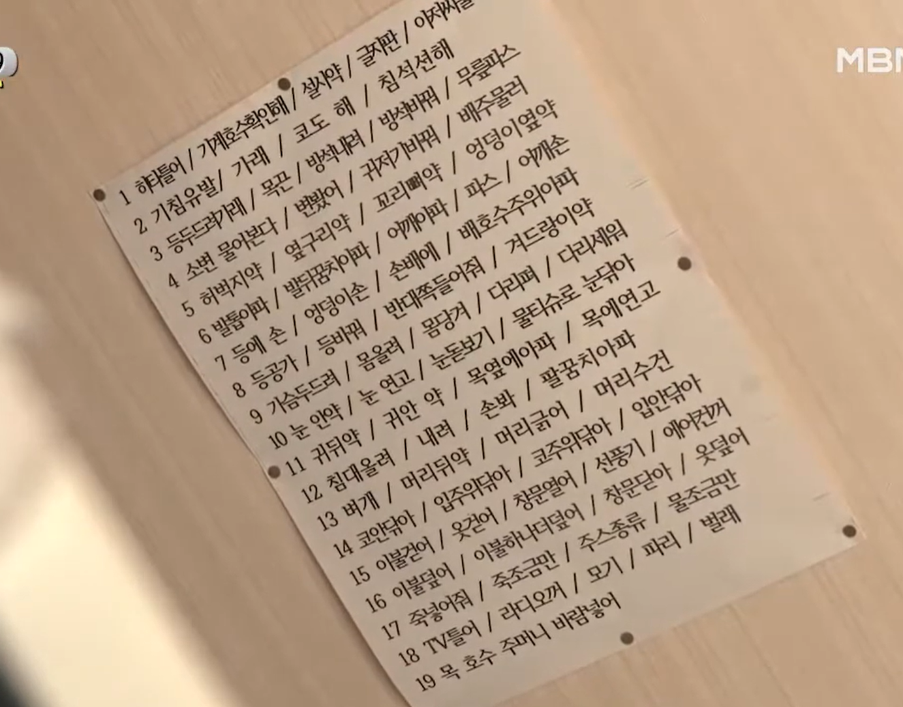
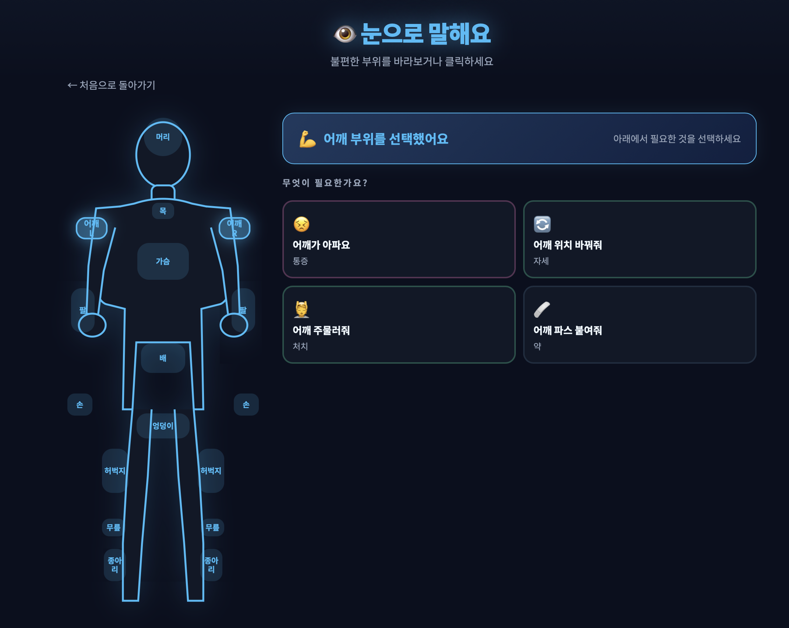

# TIL - 2026.02.27

## 1. 프로토타입 만들기

루게릭병이란 운동신경이 사멸하는 질병이다. 환자의 병 진행상태에 따라 활동 가능 범위가 제각각이지만, 중증으로 넘어가면 안구 근육을 제외한 나머지 근육은 모두 사용할 수 없는 경우가 있다.

루게릭병을 투병중인 환자와 보호자의 소통 방식을 조사하던 중, 천장에 이미지와 같이 요구사항 리스트를 붙여놓고, 환자가 필요한 요구사항에 해당하는 번호만큼 눈을 깜빡여 보호자와 소통을 하는 방식을 발견했다.

이러한 방식으로 소통할 경우, 눈을 요구사항에 맞게 1번, 많게는 20번 가까이 깜빡이는 것이 쉽지 않아보였다. 또한 보호자도 환자의 요구사항을 알아채는 것이 어려울 것 같다는 생각을 하였다.

그래서 사람의 신체 모양을 화면에 띄우고, 환자가 불편한 부위를 응시하면 이를 인식하여 해당 부위에 대한 요구사항 리스트를 보여주는 방식을 고안했다. 이를 통해 보다 빠르고 원활한 소통이 가능할 것이라 생각했다.

또한, mvp 로는 환자와 보호자 간의 의사소통을 원활하게 하여 투병에 도움을 주고, 환우분들이 사랑하는 사람들에게 감정표현을 함으로써 삶의 활력을 얻게 하는데 도움을 주는 기능들이 있어야겠다는 생각을 하였다.

1. llm 예상 답변을 통한 더욱 간편한 채팅기능 도입
먼저 환자와 보호자 간 소통을 위해 채팅 기능을 도입하고자 했다. 그러나 환우분들이 눈으로 키보드를 한 자씩 입력하는 방식은 시간이 오래 걸릴 뿐만 아니라 눈의 피로도도 크게 높아져, 결국 해당 기능을 사용하지 않게 되는 경우가 많을 것이라 판단했다. 이를 해결하기 위해, 보호자의 채팅 내용을 LLM에 전달하여 예상 답변 3~4개를 제시하고, 추가로 직접 입력하기 기능도 제공하는 방식을 고안했다. 원하는 답변이 있다면 해당 선택지를 응시하는 것만으로 빠르게 대화를 이어나갈 수 있다.

2. 감정표현 기능

감정 표현 기능은 환우가 현재 자신의 감정 상태를 보호자에게 전달할 수 있도록 돕는 기능이다. 기쁨, 슬픔, 불안, 외로움 등 다양한 감정 카드 중 해당하는 것을 응시하여 선택하고, 감정의 긴급도(지금 당장, 곧, 나중에)까지 전달할 수 있다. 텍스트만으로는 표현하기 어려운 심리적 상태를 직관적으로 공유함으로써, 환우가 사랑하는 사람들에게 자신의 감정을 전달하고 정서적 유대를 이어갈 수 있도록 돕는다.

3. 루틴 기능

루틴 기능은 하루 일정을 시간순으로 한눈에 확인할 수 있는 기능이다. 기상, 식사, 투약, 물리치료, 목욕 등 환우의 일과를 타임라인 형태로 보여주며, 각 항목이 완료되었는지, 현재 진행 중인지, 아직 예정인지를 시각적으로 표시한다. 이를 통해 환우 본인도 오늘 하루 일정을 인지할 수 있고, 보호자와의 케어 루틴을 체계적으로 관리할 수 있다.

4. 연락처 기능

연락처 기능은 보호자, 담당 간호사, 담당 의사 등 주요 인물에게 빠르게 연락할 수 있는 기능이다. 전화 및 영상통화 연결이 가능하며, "지금 와줄 수 있어요?", "물 주세요", "많이 아파요" 등 자주 쓰이는 빠른 메시지를 선택해 즉시 전달할 수도 있다. 응급 상황이나 즉각적인 도움이 필요한 순간에 특히 유용하게 활용될 수 있다.

5. 연락처 기능

기록 기능은 감정 전달, 채팅, 요청 등 앱 내에서 이루어진 모든 소통 이력을 시간순으로 저장하고 확인할 수 있는 기능이다. 보호자가 자리를 비운 사이 환우가 전달한 내용도 기록으로 남아 나중에 확인할 수 있으며, 지속적인 케어를 위한 참고 자료로도 활용될 수 있다.

## 2. ai 과제 제출
