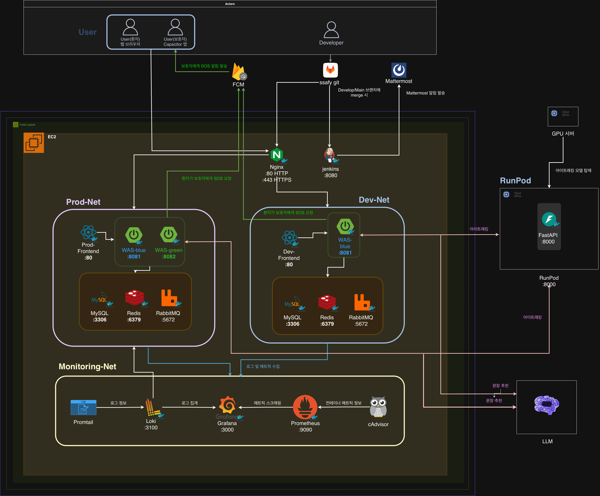

# TIL - Jenkins 파이프라인 + GitLab Webhook 연동

## 오늘 한 일

Jenkins Pipeline 프로젝트를 생성하고, GitLab에 Jenkinsfile을 만들어서 빌드 테스트에 성공했다. 이후 GitLab Webhook을 설정해서 develop 브랜치에 push하면 Jenkins가 자동으로 빌드되도록 CI/CD 파이프라인을 완성했다. 또한 인프라 아키텍처 초안을 작성했다.

---

## 배운 것

### 1. Jenkins Pipeline 스크립트를 넣는 방식이 두 가지 있다

Jenkins에 직접 스크립트를 작성하는 방식(Pipeline script)과, GitLab 저장소에 Jenkinsfile을 넣고 가져오는 방식(Pipeline script from SCM) 두 가지가 있다.

**SCM 방식이 표준이다.** Jenkins에 직접 넣으면 Jenkins 컨테이너가 날아갈 때 스크립트도 같이 사라지지만, Jenkinsfile이 GitLab에 있으면 Jenkins를 새로 깔아도 연결만 하면 복구된다. 그리고 Jenkinsfile도 Git으로 버전 관리가 되니까 히스토리 추적, 코드 리뷰, 브랜치별 다른 파이프라인 설정이 가능하다.

### 2. Jenkins는 자기만의 작업 공간(workspace)에서 빌드한다

처음에 혼란스러웠던 부분이 있다. EC2에 `git clone`으로 받아둔 저장소에서 빌드가 일어나는 줄 알았는데, Jenkins 빌드 테스트가 성공했는데도 그 저장소에는 최신 코드가 없었다. `git pull`을 해야 최신 코드가 나타났다.

알고 보니 Jenkins는 **자기만의 workspace**에서 별도로 clone을 받아서 빌드한다.

```
EC2 파일 시스템:
├── /home/ubuntu/S14P21E205/          ← 내가 직접 clone한 거 (Jenkins와 무관)
└── /var/jenkins_home/workspace/
    └── eyespeak-backend/             ← Jenkins가 자기가 clone한 거 (여기서 빌드)
```

Jenkins 컨테이너 안에서 독립적으로 동작하는 거라서, 내가 EC2에서 직접 clone한 저장소와는 완전히 별개다. Jenkins 빌드 로그에도 `Running on Jenkins in /var/jenkins_home/workspace/eyespeak-backend`라고 찍혀있었는데, 이게 Jenkins의 작업 디렉토리였던 거다.

즉, **EC2에서 직접 `git clone`한 폴더는 Jenkins CI/CD와 관계없다.** 수동으로 확인하거나 테스트할 때만 쓰면 되고, 실제 빌드/배포는 Jenkins workspace에서 일어난다.

### 3. GitLab Webhook으로 자동 빌드를 설정하는 법을 배웠다

Webhook 설정 전에는 Jenkins에서 "지금 빌드" 버튼을 수동으로 눌러야 했다. Webhook을 설정하면 GitLab에 push할 때 GitLab이 Jenkins에 "코드 바뀌었어!"라고 HTTP 요청을 보내고, Jenkins가 자동으로 빌드를 시작한다.

설정 과정은 양쪽에서 해야 한다:

**Jenkins 쪽:** 빌드 유발(Build Triggers)에서 "Build when a change is pushed to GitLab" 체크하고, webhook URL과 Secret token을 생성한다.

**GitLab 쪽:** Settings > Webhooks에서 Jenkins의 webhook URL과 Secret token을 등록하고, Push events를 트리거로 설정한다. Branch filter에 `develop`을 넣으면 develop 브랜치에 push할 때만 빌드가 돌아간다.

### 4. Webhook에서 SSL verification을 꺼야 할 수 있다

GitLab에서 Webhook을 등록할 때 SSL verification 옵션이 있는데, EC2의 Jenkins가 아직 HTTPS(SSL)가 아니라 HTTP로 돌아가고 있어서 이 옵션을 체크 해제해야 했다. 나중에 Nginx + SSL 설정을 하면 다시 켜도 된다.

### 5. Jenkinsfile은 프로젝트 루트에 둔다

Jenkinsfile은 GitLab 저장소의 최상위(루트)에 위치해야 한다. Jenkins Pipeline 설정에서 Script Path를 `Jenkinsfile`로 지정했기 때문이다. 하위 폴더에 넣으려면 `backend/Jenkinsfile` 같이 경로를 바꿔야 한다.

테스트용으로 만든 Jenkinsfile:

```groovy
pipeline {
    agent any
    stages {
        stage('Clone') {
            steps { echo '코드 가져오기 완료' }
        }
        stage('Build') {
            steps { echo '빌드 테스트 성공' }
        }
        stage('Deploy') {
            steps { echo '배포 테스트 성공' }
        }
    }
}
```

지금은 echo만 찍는 테스트용이고, 나중에 실제 빌드(Gradle), Docker 이미지 생성, Blue/Green 배포 스크립트를 여기에 채워넣을 예정이다.

---

## 삽질 기록

- Jenkins 빌드 성공했는데 EC2의 clone 폴더에 최신 코드가 없어서 혼란 → Jenkins workspace는 별도 공간이라는 걸 깨달음
- Jenkins "Pipeline script from SCM" 설정 시 Definition 드롭다운이 "Pipeline script"로 되어있어서 SCM 관련 입력칸이 안 보였음 → 드롭다운 변경 필요
- `.ssh` 폴더에서 SSH 키 정리하려다가 `authorized_keys` 파일도 지울 뻔함 → 이건 EC2 접속 키라 절대 지우면 안 됨

---

## 6. 인프라 아키텍처 초안 작성



### 고민한 부분
인프라 아키텍처를 정리하면서 아이트래킹 AI 모델을 어디에서 돌릴지 고민했다. 핵심은 실시간 처리와 지연(latency) 문제였다.
처음에는 단순히 RunPod 같은 GPU 서버에 올려서 추론하면 되겠지라고 생각했다. 그런데 실제 플로우를 그려보니까 구조가 이렇게 된다.

```
프론트 → 백엔드 → RunPod → 백엔드 → 프론트
```

이 구조에서는 네트워크 왕복 구간이 여러 번 생긴다. 특히 실시간 아이트래킹에서는 이 지연이 체감될 수 있다.
그래서 대안을 두 가지로 나눠서 생각해봤다.

**1. 프론트에서 모델을 직접 돌리는 방식**

브라우저에서 바로 모델 추론까지 수행하는 방식이다. 서버로 영상 데이터를 보내지 않는다.
이 방식의 가장 큰 장점은 네트워크 왕복이 없어서 지연이 가장 적다는 것이다. 실시간 처리에는 가장 유리하다.
하지만 문제는 모델이 무거우면 브라우저에서 돌리기 어렵다는 점이다. 메모리나 연산 성능 한계 때문에 저사양 PC나 모바일에서는 느려질 수 있다.
그래서 보통은

```
MediaPipe 같은 가벼운 모델 → 프론트
YOLO 같은 무거운 모델 → 서버
```
이렇게 나눠서 쓰는 경우가 많다.

**2. 프론트–백엔드를 WebSocket으로 연결하는 방식**

모델은 그대로 RunPod 서버에서 돌리고, 대신 프론트와 백엔드를 WebSocket으로 연결하는 방식이다.

```
프론트 ⇄(WebSocket)⇄ 백엔드 → RunPod → 백엔드 → 프론트
```

WebSocket을 사용하면 매 요청마다 HTTP 연결을 새로 만들지 않고, 한 번 연결을 유지한 채로 데이터를 주고받을 수 있다.
그래서 프론트–백엔드 구간의 연결 오버헤드는 줄일 수 있다.
다만 백엔드와 RunPod 사이의 물리적인 지연 자체는 그대로라는 한계가 있다.
정리
지연만 보면 프론트에서 모델을 돌리는 게 가장 좋다.
하지만 모델이 무거우면 브라우저에서 돌리기 부담이 있다.
그래서 현재 설계는

```
모델은 RunPod에서 추론
프론트–백엔드는 WebSocket으로 연결
```
과 같이 해서 지연을 조금이라도 줄이는 구조
로 정리했다.

---

## 현재 진행 상황

```
인프라 세팅:
✅ EC2 Docker / Docker Compose 설치
✅ Jenkins 컨테이너 설치 + 초기 설정
✅ GitLab HTTPS 연동 (Project Access Token)
✅ Jenkins Pipeline 생성 + Jenkinsfile 테스트 빌드 성공
✅ GitLab Webhook 설정 (develop push 시 자동 빌드)

다음 할 것:
⬜ Jenkinsfile에 실제 빌드/배포 로직 작성
⬜ Nginx + SSL 설정
⬜ Docker Compose (dev/prod) 구성
⬜ Blue/Green 배포 스크립트
```

---

## 느낀 점

Jenkins가 자기만의 workspace에서 독립적으로 동작한다는 걸 몰랐으면 나중에 "왜 배포했는데 코드가 안 바뀌지?" 하고 한참 삽질했을 거다. CI/CD 도구가 내부적으로 어떻게 동작하는지 이해하는 게 중요하다는 걸 느꼈다. Webhook까지 설정하니까 push만 하면 자동 빌드가 돌아가는 게 신기했다. 다음은 테스트용 echo 대신 실제 Gradle 빌드와 Docker 이미지 생성을 Jenkinsfile에 넣어봐야겠다.