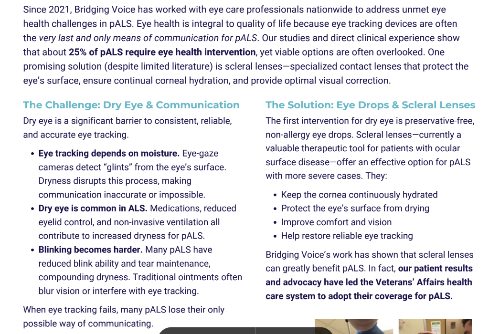
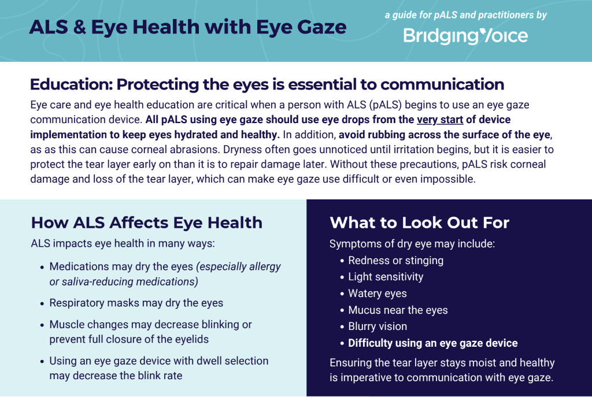

# 2026-03-06

## 🔄 KPT 회고

---

### ✅ Keep — 계속 유지할 것

- **작은 단위의 사이클 경험**: AI 영상 학습을 한 세션 마무리하며 계획을 완수했다. 계획 하나를 완수했을 때의 뿌듯함 뿐만 아니라, 실제로 중간에 하다가 마는 것보다 훨씬 더 많은 인사이트를 얻을 수 있었다. 앞으로도 **'작은 단위의 계획 → 완수 → 피드백'** 의 사이클을 더 많이 경험할 수 있도록 업무 및 학습 구조를 꾸준히 짜나가는 태도를 유지해야겠다. *(세부적인 내용은 AI_TEST 폴더에 작성)*

---

### ❌ Problem — 문제가 된 것

- (특이사항 없음)

---

### 💡 Try — 다음에 시도할 것

- **프로토타이핑을 통한 직접 검증**: 구두로 하는 논리적 설명 논의에 그치지 않고, 프로토타입을 만들어 **실제로 성능이나 병목이 어떻게 발생하는지 눈으로 직접 확인**해보는 과정을 도입한다. 특히 AI 활용 부분에서 프로토타입을 구축하고 테스트해보는 시도가 매우 유용할 것이다.

---

## 📚 금일 학습한 내용

---

## 1. NoSQL (Not Only SQL)

### 개념
기존의 정형화된 관계형 데이터베이스(RDBMS, 예: MySQL, Oracle)와 달리, 데이터 간의 관계를 정의하지 않고 스키마(Schema) 없이 유연한 형태로 데이터를 저장하는 데이터베이스이다. 가장 대표적인 형태로 개별 고유한 키(Key)와 이에 대응하는 속성 값(Value)의 쌍으로 단순하게 데이터를 저장하는 **Key-Value 스토어**(예: Redis, DynamoDB 등)가 있다.

### 📈 장단점
- **장점 (Pros)**:
  - **유연성**: 고정된 구조가 없어, 데이터 형태가 자주 변경되는 프로젝트나 비정형 데이터를 다룰 때 매우 유리하다.
  - **뛰어난 확장성과 속도**: 분산 컴퓨팅 환경에 최적화되어 서버를 가로로 늘리는 스케일 아웃(Scale-out)이 매우 쉽고, 구조가 단순한 만큼 대용량 데이터의 읽기/쓰기 처리 속도가 월등히 빠르다.
- **단점 (Cons)**:
  - 기존 RDBMS에서 기본으로 제공하는 데이터 간의 JOIN 연산을 맺기가 구조적으로 어려워, 고도로 복잡한 쿼리를 작성하는 데 제약이 크다.
  - 엄격한 데이터 일관성이나 원자성 보장(트랜잭션 ACID) 특성이 RDBMS보다 상대적으로 약하기 때문에, 정합성이 최우선인 금융권 등의 서비스에는 도입이 까다롭다.

---

## 2. 그래프 DB (Graph Database) - Neo4j

### 개념
데이터를 단순한 테이블이나 도큐먼트 형태가 아닌, **노드(Node: 엔티티), 엣지(Edge: 관계), 프로퍼티(Property: 속성)**라는 수학 연관 네트워크 그래프 형태로 저장하는 형태의 데이터베이스이다. 데이터 자체만큼이나 **데이터 간의 '관계(Relationship)' 자체를 중요한 1급 객체**로 다루는 것이 핵심적인 차이이며, 그 중에서도 **Neo4j**가 가장 대표적으로 사용된다.

### 📈 장단점
- **장점 (Pros)**:
  - **복잡한 네트워크 탐색 최적화**: 기존 RDBMS에서는 수많은 테이블을 다중 JOIN 해야 해서 막대한 성능 저하를 유발하는 고도화된 관계망 데이터 모델링(예: 소셜 네트워크의 친구의 친구 추천, 경로 탐색, 부정 탐지 시스템 등)을 매우 직관적이고 빠르게 쿼리(Cypher) 하나로 탐색해 낼 수 있다.
  - 별도의 스키마를 부수지 않고 새로운 관계와 속성을 아주 쉽게 추가 및 수정할 수 있다.
- **단점 (Cons)**:
  - 노드의 단순 목록 나열이나 통계 집계 등 전체 구조를 대상으로 하여 관계 탐색이 무의미한 보편적인 데이터베이스 접근에서는 오히려 다른 DB에 비해 성능 이점이 없다.
  - RDBMS나 다른 범용 NoSQL보다 도입 사례 및 전문가 생태계 풀이 작고, Cypher와 같은 그래프 DB 전용 쿼리 문법을 새롭게 학습해야 하는 초기 러닝 커브가 존재한다.

---

## 3. 추천 로직의 분석 및 검증 데이터 구성 시도

### 추천 로직의 정답(Ground Truth) 확보 어려움
추천 로직을 담당하게 되면서 어떤 추천이 올바른지 정답을 알아야 하지만, 프로젝트 환경 특성상 실제 루게릭 환자분들에게 직접 테스트를 요청하며 피드백을 수집하기는 무리가 있다는 근본적인 문제 상황에 직면했다.

### 상황 기반의 검증 및 정량적 평가 시도
환자 테스트가 불가능한 환경에 대한 대안(미봉책)으로, 통증 지도 및 일반 소통 환경 등 루게릭 환자들이 겪을 법한 가상의 **'상황' 자체를 검증 데이터**로 셋업하고,  4분할 화면 기준으로, **목표로 하는 적절한 답변을 '4번 이내'에 추천하면 히트(Hit), 그렇지 못하면 미스(Miss)**로 판정하여 로직별 히트/미스 비율을 비교한다. 이를 통해 단순 '정성적 판단'을 넘어 **'정량적 판단 및 통계화'**를 시도해보는 설계를 생각해보았다.

### 부족함에 대한 성찰
이번 개발 과정에서 파이프라인과 추천 로직을 설계하며, 나의 개발 경험 및 관련 지식 부족을 크게 통감했다. 이런 비교적 단순한 논리 구조를 하나 잡는 데에도 예상치 못하게 너무 많은 시간과 고민을 할애한 점이 많이 아쉽다. 논리 설계에 필요한 개발 지식과 논리적 구조를 쌓는 기준점이 될 만한 것들이 무엇이 있는지 더 깊이 고민하고 학습해야겠다.

---

## 4. 아이트래킹 사용에 대한 프로젝트적 인사이트와 UI 고민 

추천 로직 설계 및 UI 분할 화면 계획에서, 사용자(루게릭 환자)의 안구 건강에 대한 근본적인 고민을 하게 되었다.

국내·해외 사이트 사례를 깊이 리서치해 본 결과, 시선 추적(아이트래킹) 기기를 장시간 사용함에 따라 눈을 깜빡이는 횟수가 줄고 시선을 고정하면서 **심각한 안구 건조증을 비롯한 피로와 안구 건강 악화 문제**가 매우 빈번하게 언급되고 있음을 알 수 있었다.

*(아래 첨부된 자료들은 실제 ALS 환자의 눈 건강과 안구 추적 간의 관계 및 안구 보호 중요성에 대한 교육용 자료이다)*

위 자료를 통해 안구 건조증이 실제 시선 추적의 정확도(Glint Detect)마저 떨어뜨리며 통신을 불가능하게 한다는 것을 확인했다.

**결론 및 고찰:**
우리의 개발적인 구현 가능성으로 화면을 9분할해 다양한 객체를 제공할 수 있다 할지라도, 사용자가 작은 타겟을 정확히 쳐다보며 느낄 과도한 조작 피로도와 안구 건강에 미칠 치명적 영향을 무시해서는 안 된다.

### 안구 건강을 고려한 UI 분할 방향성 재고
따라서, 환자를 진정으로 위한 도구라면 눈의 피로를 최소화할 수 있는 훨씬 큰 타겟 존을 보장하는 **4분할 UI/UX**를 제공하는 것이 더 올바른 방향이 아닐까 하는 강력한 확신이 들었다. 다만, 이를 기반으로 필요한 기능과 정보 제공량의 트레이드오프(저-해상도 정보전달)를 극복하기 위해선 팀원들과의 더욱 깊은 형태의 고려가 필요할 것으로 보인다.
