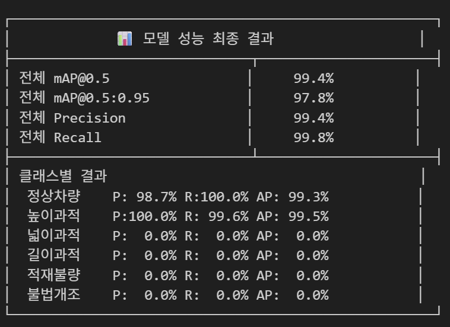

# 2026-02-23 TIL

# 1. 기획 아이디어 도출 
## 1) 화물차 판스프링 및  과적차량 탐지 서비스
판스프링 불법 부착 · 바퀴 탈락 · 과적 · 불법 튜닝 AI 영상 탐지 서비스 기획서

---
# 2. AI 모델 학습
## 데이터셋 확보
AI HUB에서 과적차량 도로 위험 데이터를 확보하여 적재 불량 등 5가지 클래스를 탐지하는 객체 탐지 모델 YOLOv8 학습을 진행함. 
    - 다른 팀원과 공유하는 데 용이하도록 주피터 노트북을 사용하여 코드를 구현하였음 
    - 

# 3. Spring-Boot 학습
## DTO를 써야 하는 이유
- API와 DB 분리 - 엔티티 변경이 API에 영향을 주지 않음
- 보안 - 클라이언트가 민감한 필드(admin, password 등)를 임의로 수정하는 것을 차단함
- 검증 로직 분리 - API 검증(@Valid)을 엔티티가 아닌 DTO에서 처리함
- 필요한 데이터만 전달 - API마다 다른 요구사항에 맞는 DTO를 만들 수 있음
- 유지보수 - 엔티티와 API를 독립적으로 수정 가능해서 변경에 유연함

---
# KPT 회고
<aside>
💡 김예린

- **KEEP**
    - 아침에 오자마자 AI 세팅을 완료한 점
    - 새벽에 AI 모델 학습 시킨 것으로 학습 모델을 완성하여 프로젝트 기획안의 가능성을 데이터나 실제 모델로 보여준 점
- **Problem**
    - 오전 일정이 계획처럼 되지 않으면, 하루의 전반적인 집중력이 낮아지는 문제점
    - 프로젝트 기획 시 추후 기대효과까지 고려하지 않고, 기술 스택이나 개발 볼륨에만 집중한 점( 숲이 아닌 나무를 보며 기획함)
- **Try**
    - 내일 중으로 JPA 강의 50% 이상 수강 도전!